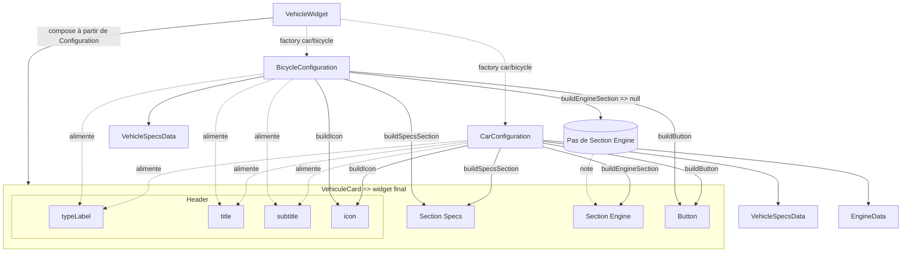
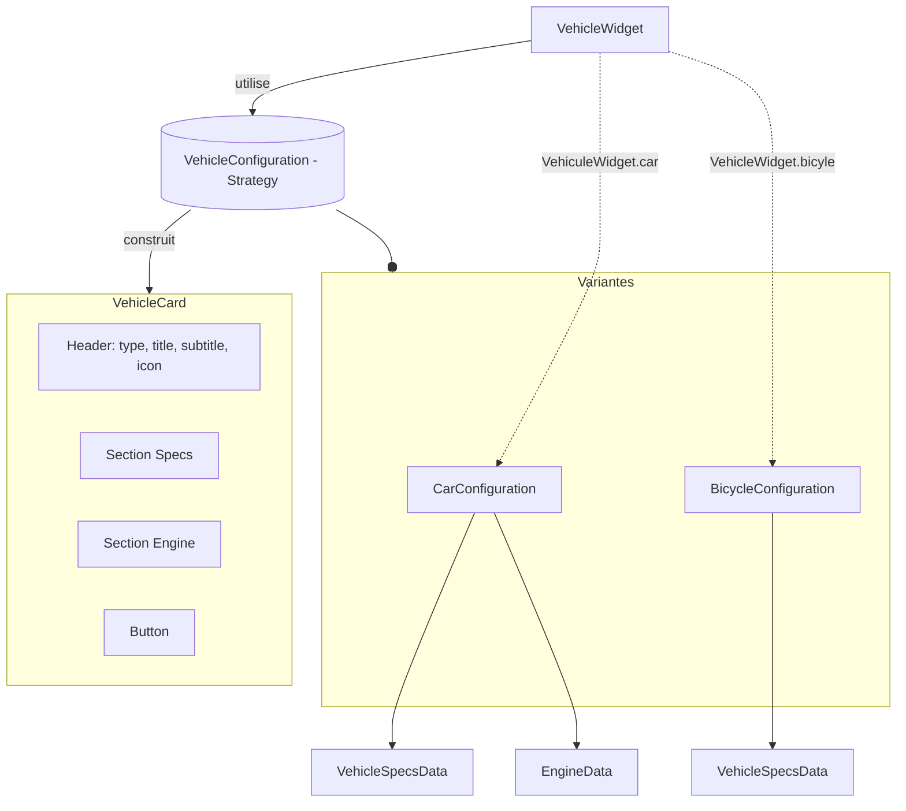
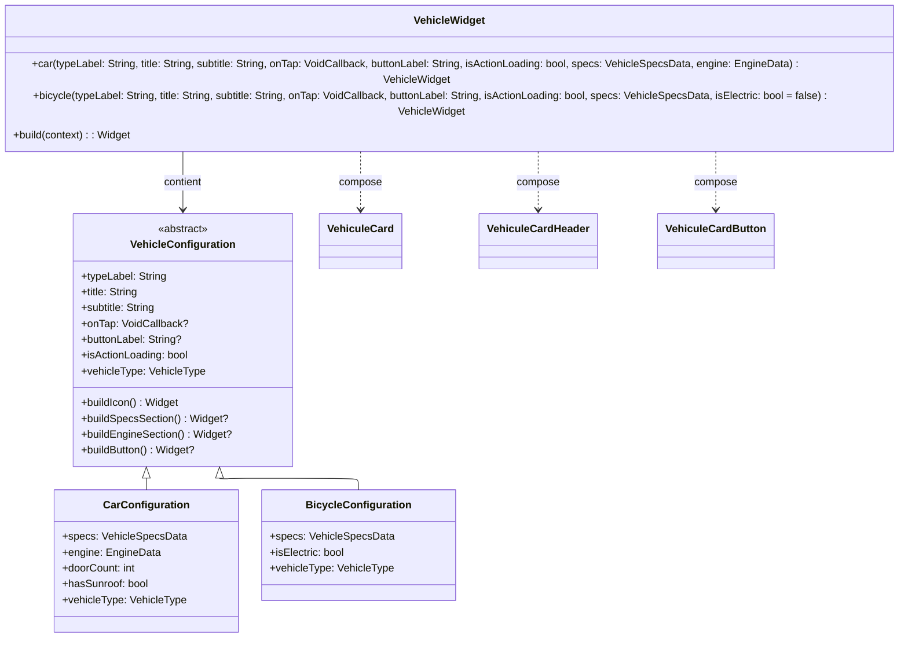

# Mermaid — Version avec Configurateur (sans Builder)

```mermaid
flowchart TD
  %% Entrée: le widget choisit une configuration concrète via les factories
  A[VehicleWidget] -.factory car/bicycle.-> C1[CarConfiguration]
  A -.factory car/bicycle.-> C2[BicycleConfiguration]

  %% Champs communs de base (transmis au Header)
  subgraph H[Header]
    H1[typeLabel]
    H2[title]
    H3[subtitle]
    H4[icon]
  end

  %% La configuration fournit les pièces prêtes à afficher
  C1 -->|buildIcon| H4
  C2 -->|buildIcon| H4
  C1 -->|buildSpecsSection| S1[Section Specs]
  C2 -->|buildSpecsSection| S1
  C1 -->|buildEngineSection| S2[Section Engine]
  C2 -->|buildEngineSection => null| X[(Pas de Section Engine)]
  X -.note.-> S2
  C1 -->|buildButton| BTN[Button]
  C2 -->|buildButton| BTN

  %% Données contenues dans chaque configuration
  C1 --> D1[VehicleSpecsData]
  C1 --> D2[EngineData]
  C2 --> D3[VehicleSpecsData]

  %% Liaison des champs simples vers le Header
  C1 -.alimente.-> H1
  C1 -.alimente.-> H2
  C1 -.alimente.-> H3
  C2 -.alimente.-> H1
  C2 -.alimente.-> H2
  C2 -.alimente.-> H3

  %% Composition finale par le widget
  subgraph R[VehiculeCard => widget final]
    H
    S1
    S2
    BTN
  end
  A -->|compose à partir de Configuration| R
```

```mermaid
flowchart TB
 subgraph Variants["Variantes"]
        V1["CarConfiguration"]
        V2["BicycleConfiguration"]
  end
 subgraph Pieces["VehicleCard"]
        H["Header: type, title, subtitle, icon"]
        S["Section Specs"]
        E["Section Engine"]
        BTN["Button"]
  end
    Strategy[("VehicleConfiguration - Strategy")] --o Variants
    A["VehicleWidget"] -- utilise --> Strategy
    V1 --> DS1["VehicleSpecsData"] & DS2["EngineData"]
    V2 --> DS3["VehicleSpecsData"]
    A -. "VehiculeWidget.car" .-> V1
    A -. "VehicleWidget.bicyle" .-> V2
    Strategy -- construit --> Pieces
```

```mermaid
---
config:
  layout: elk
---
classDiagram
direction TB
    class VehicleWidget {
        +car(typeLabel: String, title: String, subtitle: String, onTap: VoidCallback, buttonLabel: String, isActionLoading: bool, specs: VehicleSpecsData, engine: EngineData) VehicleWidget
        +bicycle(typeLabel: String, title: String, subtitle: String, onTap: VoidCallback, buttonLabel: String, isActionLoading: bool, specs: VehicleSpecsData, isElectric: bool = false) VehicleWidget
        +build(context): Widget
    }

    class VehicleConfiguration {
        +typeLabel: String
        +title: String
        +subtitle: String
        +onTap: VoidCallback?
        +buttonLabel: String?
        +isActionLoading: bool
        +vehicleType: VehicleType
        +buildIcon() Widget
        +buildSpecsSection() Widget?
        +buildEngineSection() Widget?
        +buildButton() Widget?
    }

    class CarConfiguration {
        +specs: VehicleSpecsData
        +engine: EngineData
        +doorCount: int
        +hasSunroof: bool
        +vehicleType: VehicleType
    }

    class BicycleConfiguration {
        +specs: VehicleSpecsData
        +isElectric: bool
        +vehicleType: VehicleType
    }

    class VehiculeCard {
    }
    class VehiculeCardHeader {
    }
    class VehiculeCardButton {
    }

    <<abstract>> VehicleConfiguration
    VehicleConfiguration <|-- CarConfiguration
    VehicleConfiguration <|-- BicycleConfiguration
    VehicleWidget --> VehicleConfiguration : contient
    VehicleWidget ..> VehiculeCard : compose
    VehicleWidget ..> VehiculeCardHeader : compose
    VehicleWidget ..> VehiculeCardButton : compose

```
