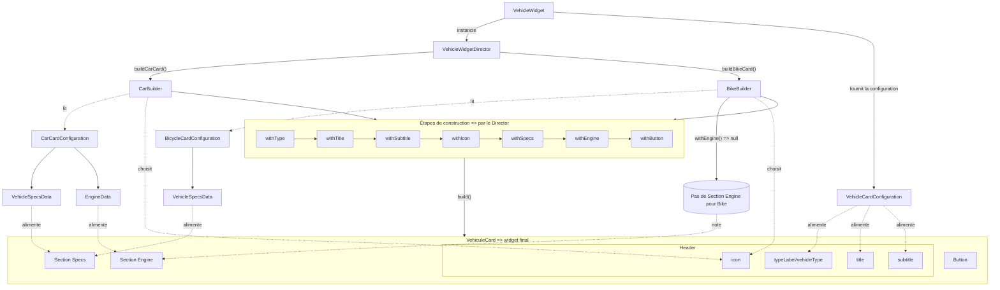
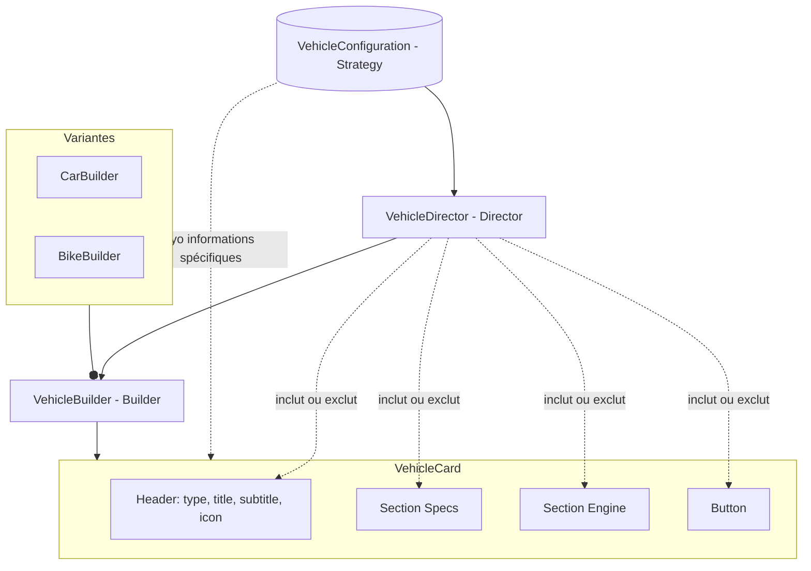
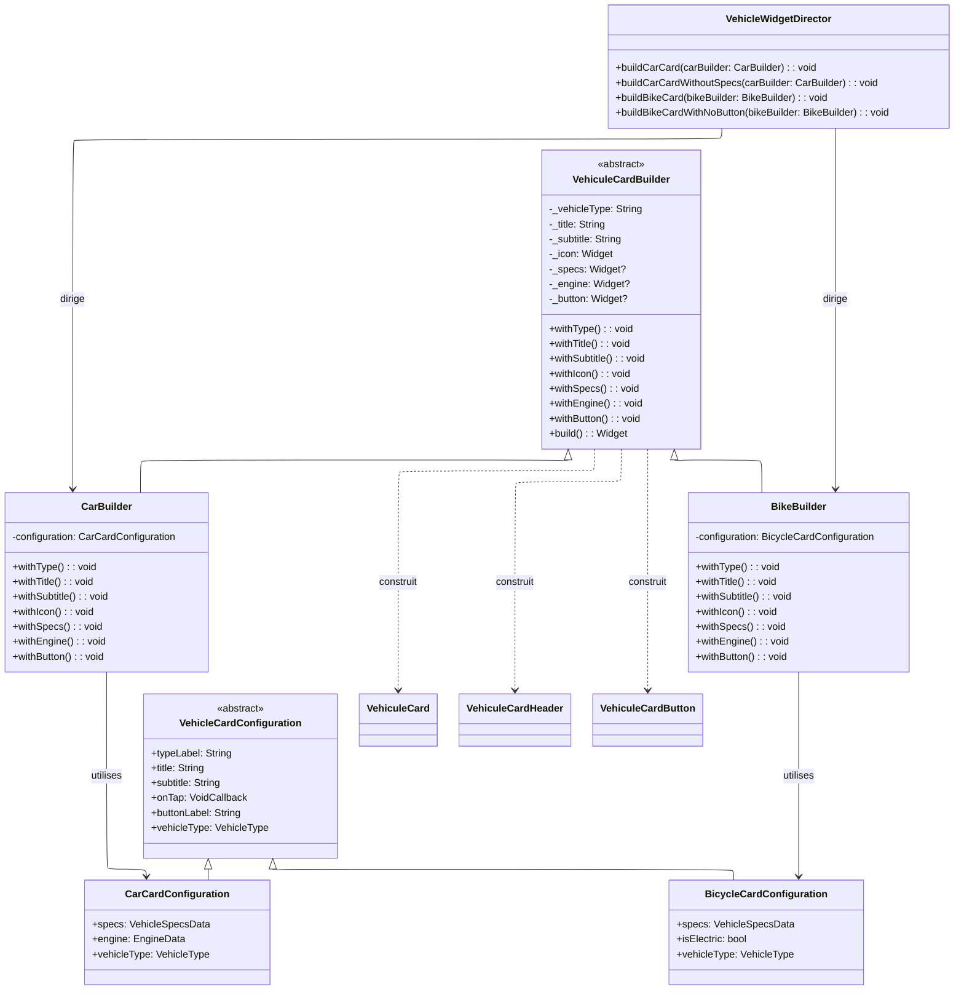

# Mermaid — Version avec Configurateur et Builder

```mermaid
flowchart TD
  %% Entrée
  A[VehicleWidget] -->|"instancie"| B[VehicleWidgetDirector]
  A -->|"fournit la configuration"| C[VehicleCardConfiguration]

  %% Sélection du builder via le Director
  B -->|"buildCarCard()"| D1[CarBuilder]
  B -->|"buildBikeCard()"| D2[BikeBuilder]

  %% Les builders lisent la configuration concrète
  D1 -.lit.-> C1[CarCardConfiguration]
  D2 -.lit.-> C2[BicycleCardConfiguration]

  %% Données contenues dans la configuration
  C1 --> E1[VehicleSpecsData]
  C1 --> E2[EngineData]
  C2 --> E3[VehicleSpecsData]

  %% Séquence des appels pilotée par le Director
  subgraph S[Étapes de construction => par le Director]
    T1[withType]
    T2[withTitle]
    T3[withSubtitle]
    T4[withIcon]
    T5[withSpecs]
    T6[withEngine]
    T7[withButton]
    T1 --> T2 --> T3 --> T4 --> T5 --> T6 --> T7
  end
  D1 --> S
  D2 --> S

  %% Résultat de build()
  subgraph R[VehiculeCard => widget final]
    subgraph H[Header]
      H1[typeLabel/vehicleType]
      H2[title]
      H3[subtitle]
      H4[icon]
    end
    S1[Section Specs]
    S2[Section Engine]
    BTN[Button]
  end

  S -->|"build()"| R

  %% Spécificités par type
  D2 -->|"withEngine() => null"| X[(Pas de Section Engine pour Bike)]
  X -.note.-> S2

  %% Liaisons de données (config -> sections)
  E1 -.alimente.-> S1
  E3 -.alimente.-> S1
  E2 -.alimente.-> S2
  C -.alimente.-> H1
  C -.alimente.-> H2
  C -.alimente.-> H3
  D1 -.choisit.-> H4
  D2 -.choisit.-> H4
```

```mermaid
flowchart TB
  Data[(VehicleConfiguration - Strategy)] --> Director[VehicleDirector - Director]
  Data -.ayo informations spécifiques.-> Pieces
  Director --> Builder[VehicleBuilder - Builder]
  Variants --o Builder

  %% Pièces concrètes composées par le Builder
  subgraph Pieces[VehicleCard]
    H[Header: type, title, subtitle, icon]
    S[Section Specs]
    E[Section Engine]
    BTN[Button]
  end

  Builder --> Pieces

  %% Variantes influencent la présence de Engine
  subgraph Variants[Variantes]
    V1[CarBuilder]
    V2[BikeBuilder]
  end
  %% Director -.sélectionne.-> Variants
  Director -.inclut ou exclut.-> S
  Director -.inclut ou exclut.-> E
  Director -.inclut ou exclut.-> H
  Director -.inclut ou exclut.-> BTN
```

```mermaid
---
config:
  layout: elk
---
classDiagram
direction TB
    class VehicleWidgetDirector {
	    +buildCarCard(carBuilder: CarBuilder) : void
	    +buildCarCardWithoutSpecs(carBuilder: CarBuilder) : void
	    +buildBikeCard(bikeBuilder: BikeBuilder) : void
	    +buildBikeCardWithNoButton(bikeBuilder: BikeBuilder) : void
    }
    class VehiculeCardBuilder {
	    -_vehicleType: String
	    -_title: String
	    -_subtitle: String
	    -_icon: Widget
	    -_specs: Widget?
	    -_engine: Widget?
	    -_button: Widget?
	    +withType() : void
	    +withTitle() : void
	    +withSubtitle() : void
	    +withIcon() : void
	    +withSpecs() : void
	    +withEngine() : void
	    +withButton() : void
	    +build() : Widget
    }
    class CarBuilder {
	    -configuration: CarCardConfiguration
	    +withType() : void
	    +withTitle() : void
	    +withSubtitle() : void
	    +withIcon() : void
	    +withSpecs() : void
	    +withEngine() : void
	    +withButton() : void
    }
    class BikeBuilder {
	    -configuration: BicycleCardConfiguration
	    +withType() : void
	    +withTitle() : void
	    +withSubtitle() : void
	    +withIcon() : void
	    +withSpecs() : void
	    +withEngine() : void
	    +withButton() : void
    }
    class VehicleCardConfiguration {
	    +typeLabel: String
	    +title: String
	    +subtitle: String
	    +onTap: VoidCallback
	    +buttonLabel: String
	    +vehicleType: VehicleType
    }
    class CarCardConfiguration {
	    +specs: VehicleSpecsData
	    +engine: EngineData
	    +vehicleType: VehicleType
    }
    class BicycleCardConfiguration {
	    +specs: VehicleSpecsData
	    +isElectric: bool
	    +vehicleType: VehicleType
    }
    class VehiculeCard {
    }
    class VehiculeCardHeader {
    }
    class VehiculeCardButton {
    }
	<<abstract>> VehiculeCardBuilder
	<<abstract>> VehicleCardConfiguration
    VehiculeCardBuilder <|-- CarBuilder
    VehiculeCardBuilder <|-- BikeBuilder
    VehicleWidgetDirector --> CarBuilder : dirige
    VehicleWidgetDirector --> BikeBuilder : dirige
    VehicleCardConfiguration <|-- CarCardConfiguration
    VehicleCardConfiguration <|-- BicycleCardConfiguration
    CarBuilder --> CarCardConfiguration : utilises
    BikeBuilder --> BicycleCardConfiguration : utilises
    VehiculeCardBuilder ..> VehiculeCard : construit
    VehiculeCardBuilder ..> VehiculeCardHeader : construit
    VehiculeCardBuilder ..> VehiculeCardButton : construit

```
